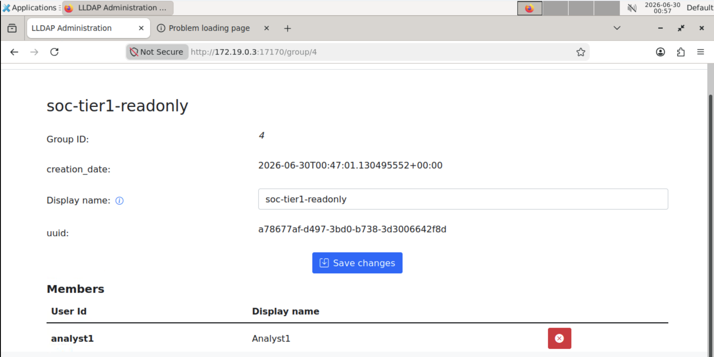
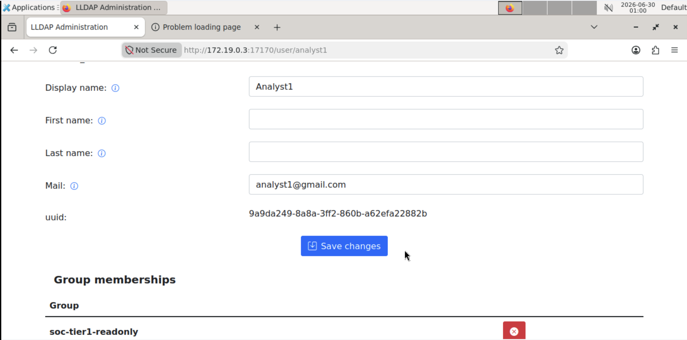
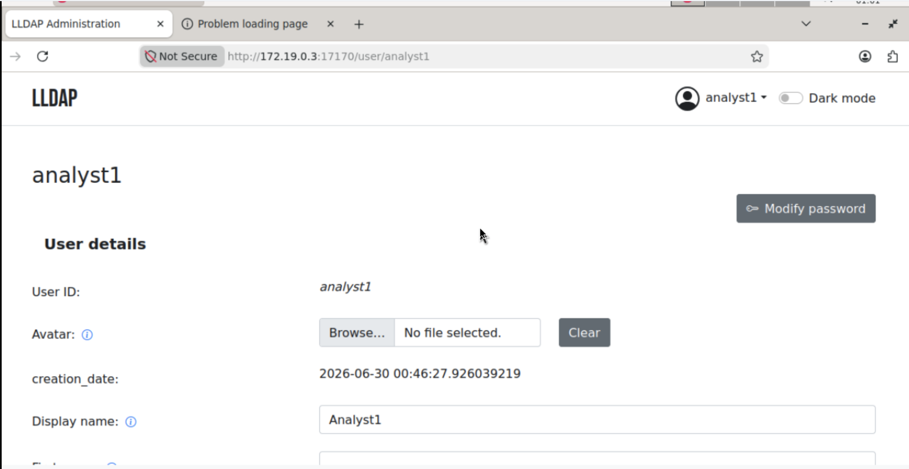
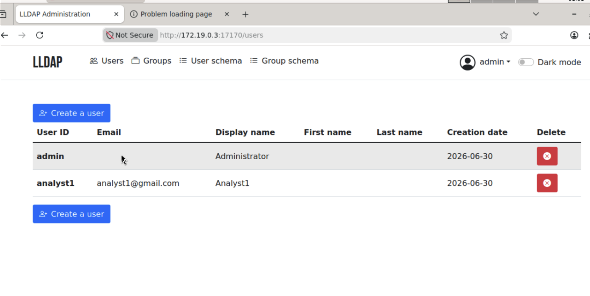

# Lab 01 — LDAP Least-Privilege Group Policy

**Tools:** LLDAP (Light LDAP) directory server · LDAP authentication endpoint · web-based identity management console
**Domains:** Identity & Access Management · Role-Based Access Control (RBAC) · Access Governance

---

## Problem

In any directory service, a user being able to *log in* is not the same as a user being
*allowed to do anything*. A common real-world failure is granting a Tier 1 analyst more
authority than their role requires — violating **least privilege** and creating an
escalation path. The goal of this lab was to build and *prove* a least-privilege model in
a directory: a normal analyst account that can authenticate and see what it needs, but
holds **zero administrative authority**.

## Solution

I designed a least-privilege access model around **group membership as the control**:

- A non-privileged user (`analyst1`) — deliberately *not* the built-in admin account.
- A read-only group (`soc-tier1-readonly`) modeling "visibility without authority."
- Membership-driven privilege: the user's effective access is governed purely by which
  group it belongs to — not by any per-user permission toggles.

This separates **authentication (AuthN — verifying who you are)** from **authorization
(AuthZ — what you're allowed to do)**, which is the core control behind access
certification and periodic access reviews.

## Steps

1. **Mapped the IAM/LDAP surface.** Identified the two endpoints and their roles: the web
   management console on port **17170** (where policy is *configured* — the control plane)
   versus the LDAP endpoint on port **3890** (where applications *bind* to authenticate —
   the enforcement plane). Confirmed the bootstrap `admin` account as the built-in
   superuser, used only to build and validate policy.
2. **Created a non-admin identity.** Provisioned `analyst1` so policy could be validated
   against a normal account rather than the all-powerful admin.
3. **Built a least-privilege group policy.** Created `soc-tier1-readonly`
   ("Tier 1 analysts. Read visibility only. No admin changes.").
4. **Assigned membership and verified exclusion.** Added `analyst1` to
   `soc-tier1-readonly` and confirmed it was **not** a member of `lldap_admin` — because
   membership is what drives effective privilege.
5. **Validated the policy live.** Logged in as `analyst1`: authentication **succeeded**,
   but the Users, Groups, User Schema, and Group Schema admin tabs were **absent entirely**
   and no administrative action was possible. Logged back in as `admin` and confirmed the
   tabs/privileges returned — proving access was governed purely by group membership.

## Security Outcome

Demonstrated and validated **least-privilege access control** in a directory service, with
authentication cleanly separated from authorization: the test user was fully authenticated
yet restricted to read-only visibility, with all high-impact admin actions blocked.

This is the exact control that underpins **access certification / recertification**
(periodic access reviews) and maps directly to enterprise **Active Directory** group
policy — a daily IAM job function.

### Blue-team evidence notes

- **Allowed as `analyst1`:** authenticate / sign in; read-only visibility consistent with Tier 1 scope.
- **Blocked as `analyst1`:** admin tabs not rendered; no create/modify/delete on directory objects; no privilege-escalation path observed via the UI.
- **Confirmed as `admin`:** `soc-tier1-readonly` contained only the intended member; no unintended membership in `lldap_admin`.
- **Hardening recommendation:** UI element hiding is *convenience, not the security boundary* — enforcement must be server-side at the directory/LDAP layer so direct API/bind attempts are denied even when front-end controls are bypassed. Additionally: treat the bootstrap `admin` as an emergency-only **break-glass** account with monitoring/alerting, and subject all group memberships to periodic access review.

## Key Concepts Reinforced

- **AuthN vs AuthZ** — a user can be fully authenticated and still hold near-zero privilege.
- **Least privilege via group membership** — effective access is driven by group assignment; add/remove from a group to change authority.
- **Control plane vs enforcement plane** — policy is configured on the web UI (17170); authentication is enforced where applications bind to LDAP (3890).
- **Break-glass admin hygiene** — the built-in superuser is for setup and emergencies only, never routine work.
- **Defense in depth** — never rely on UI hiding alone; enforce access decisions server-side.

---

## Artifacts

**The group and its membership**

| Screenshot | What it shows |
|------------|---------------|
|  | The `soc-tier1-readonly` group with `analyst1` listed as a member — the least-privilege group, created |
|  | The same relationship from the user side: `analyst1`'s **Group memberships** show only `soc-tier1-readonly` |

**The proof — same directory, two privilege levels (before / after)**

| `analyst1` (non-privileged) | `admin` (superuser) |
|------------------------------|----------------------|
|  |  |
| Logged in successfully (AuthN passed), but the nav bar shows **no admin tabs** — no Users, Groups, User schema, or Group schema. Zero administrative authority (AuthZ denied). | The bootstrap admin sees **all four admin tabs** and the full user list with create/delete controls. |

The side-by-side is the whole point: **same directory, same login flow — the only difference is group membership, and that alone determines the entire authorization surface.**

*Lab values (`analyst1`, `soc-tier1-readonly`, the `172.19.0.3` container IP) are non-production training data.*
